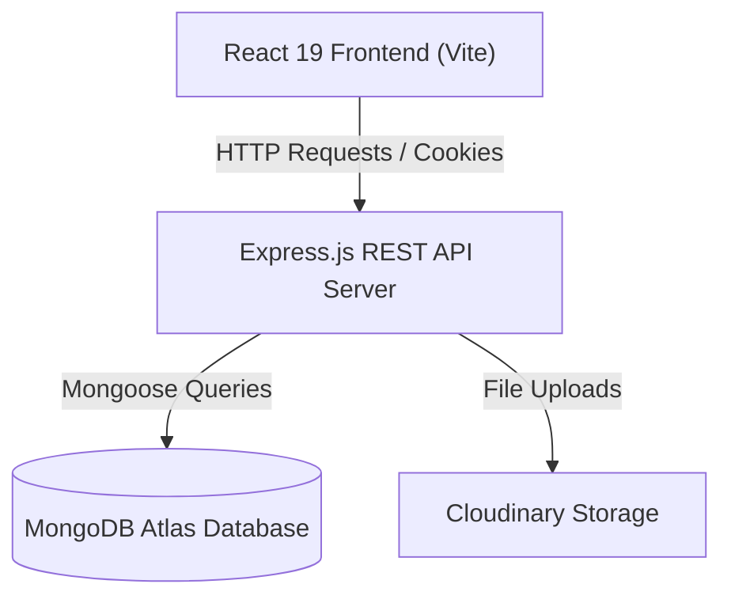

# JobHub — Full-Stack Job Portal & Recruiter Management Platform

JobHub is a modern, full-stack MERN (MongoDB, Express, React, Node.js) web application designed to connect job seekers with top employers. It features role-based workflows for **Job Seekers** and **Recruiters**, offering advanced job search, instant applications, profile & resume management, recruiter analytics, company administration, and applicant tracking.

---

## 🌟 Key Features

### 👨‍💻 For Job Seekers (Students / Candidates)
- **Account Registration & Profiles**: Manage personal bios, skill tags, contact details, and resume PDF files.
- **Job Exploration**: Browse and search jobs with filters for industry, location, and salary ranges.
- **Instant Applications**: Apply for desired listings with one click.
- **Application Status Tracker**: Real-time status tracking (`Pending`, `Accepted`, `Rejected`) with update notifications.

### 🏢 For Recruiters & Employers
- **Recruiter Dashboard**: Visual analytics overview powered by Recharts (total listings, application statistics, active companies).
- **Company Management**: Create and update company profiles, upload company logos, and link corporate websites.
- **Job Posting & Management**: Create detailed job listings specifying experience levels, salary, skills, and positions.
- **Applicant Evaluation**: Review applicant profiles, inspect submitted resumes, and update application status (`Accept` / `Reject`).

---

## 🛠️ Technology Stack

| Domain | Technologies |
| :--- | :--- |
| **Frontend** | React 19, Vite, Redux Toolkit, Redux Persist, React Router DOM v7, Tailwind CSS v4, Lucide React, Recharts, Sonner (Toasts) |
| **Backend** | Node.js, Express.js (v5), Mongoose (MongoDB Atlas OR Local MongoDB), JWT (Authentication), Cookie-Parser, Cors |
| **Cloud Services** | Cloudinary (Image & Resume uploads), Nodemailer (Email notifications) |

---

## 📐 Architecture Diagram



---

## 📁 Repository Structure

```
JobHub/
├── backend/                  # Node.js & Express API Server
│   ├── config/               # Database connection logic (db.js)
│   ├── controllers/          # Business logic handlers
│   ├── middleware/           # Auth & Error handling middlewares
│   ├── models/               # Mongoose Schemas (User, Job, Company, Application, Notification)
│   ├── routes/               # Express API Route declarations
│   ├── utils/                # Helper utilities (Cloudinary, DataUri)
│   ├── server.js             # API entry point
│   └── package.json
└── frontend/                 # React 19 Frontend App
    ├── public/               # Static assets
    ├── src/
    │   ├── assets/           # Media & Graphics
    │   ├── components/       # Shared UI Components & Navbar
    │   ├── hooks/            # Custom React hooks
    │   ├── pages/            # View pages (Home, Jobs, Profile, Admin Dashboard, etc.)
    │   ├── redux/            # Redux Slices & Store Configuration
    │   ├── App.jsx           # Main Router Configuration
    │   └── main.jsx          # App Bootstrap
    ├── vite.config.js
    └── package.json
```

---

## ⚡ Quick Start Guide

### Prerequisites
- [Node.js](https://nodejs.org/) (v18+ recommended)
- [npm](https://www.npmjs.com/)
- [MongoDB Atlas Account](https://www.mongodb.com/cloud/atlas) or local MongoDB instance

---

### 1. Clone the Repository

```bash
git clone https://github.com/your-username/JobHub.git
cd JobHub
```

---

### 2. Backend Configuration & Setup

Navigate to the `backend` directory and install dependencies:

```bash
cd backend
npm install
```

Create a `.env` file in the `backend/` directory with the following variables:

```env
PORT=5000
MONGO_URI=your_mongodb_connection_string

# Authentication
JWT_SECRET=your_super_secret_jwt_key
JWT_EXPIRES_IN=7d
COOKIE_EXPIRE=7

# Email Services
SMTP_USER=your_email@gmail.com
SMTP_PASSWORD=your_app_specific_password

# Cloudinary Setup
CLOUD_NAME=your_cloudinary_cloud_name
API_KEY=your_cloudinary_api_key
API_SECRET=your_cloudinary_api_secret
```

Start the backend server:

```bash
# Development mode with Nodemon
npm run dev

# Production mode
npm start
```

---

### 3. Frontend Configuration & Setup

In a new terminal window, navigate to the `frontend` directory and install dependencies:

```bash
cd frontend
npm install
```

Start the frontend development server:

```bash
npm run dev
```

The application will be accessible at:
- **Frontend App**: `http://localhost:5173`
- **Backend API**: `http://localhost:5000`

---

## 🔌 API Reference Table

| Category | Endpoint | Method | Description |
| :--- | :--- | :--- | :--- |
| **System** | `/api/health` | `GET` | Service health check |
| **Auth** | `/api/v1/auth/register` | `POST` | Register a new user |
| **Auth** | `/api/v1/auth/login` | `POST` | User authentication & JWT cookie issuance |
| **Auth** | `/api/v1/auth/logout` | `GET` | Clear authentication cookie |
| **User** | `/api/v1/user/profile/update` | `POST` | Update bio, skills, and resume upload |
| **Company** | `/api/v1/company/get` | `GET` | Fetch recruiter's companies |
| **Company** | `/api/v1/company/register` | `POST` | Register a new company |
| **Company** | `/api/v1/company/update/:id` | `PUT` | Update company information & logo |
| **Jobs** | `/api/v1/job/get` | `GET` | Get all active job listings |
| **Jobs** | `/api/v1/job/get/:id` | `GET` | Get single job details |
| **Jobs** | `/api/v1/job/post` | `POST` | Recruiter job posting |
| **Applications** | `/api/v1/application/apply/:id` | `GET` | Apply for a specific job |
| **Applications** | `/api/v1/application/get` | `GET` | Get candidate's application history |
| **Applications** | `/api/v1/application/:id/applicants` | `GET` | Recruiter view of candidates for a job listing |
| **Applications** | `/api/v1/application/status/:id/update` | `POST` | Update application status (`accepted`/`rejected`) |

---

## 📄 License

This project is open-source and available under the [ISC License](LICENSE).
